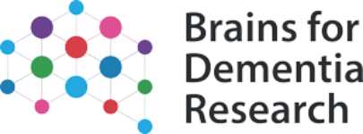
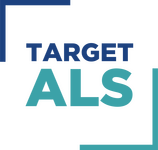

# Guide to using the App

## Contacts

- Renata Kabiljo <renata.kabiljo@kcl.ac.uk>
- Guy Hunt <guy.hunt@kcl.ac.uk>
- Alfredo Iacoangeli <alfredo.iacoangeli@kcl.ac.uk>

## The Data

- KCL Brain Bank
- Target ALS

## Gene Expression Explorer

Boxplot and Table of Results for selected gene and dataset(s).

## DESeq2 Results Table

Use the search tabs to subset the table by Dataset, log fold change, P-value adjusted P-value.

**Experiment:**

- Case (ALS) vs Control

**Tissue:**

- Motor Cortex

## Affiliations, Funding and Acknowledgements

1. Department of Biostatistics and Health Informatics, Institute of Psychiatry, Psychology and Neuroscience, King's College London, London, UK
2. Department of Basic and Clinical Neuroscience, Maurice Wohl Clinical Neuroscience Institute, Institute of Psychiatry, Psychology and Neuroscience, King's College London, London, SE5 9NU, UK
3. Perron Institute for Neurological and Translational Science, Nedlands, WA 6009, Australia
4. Centre for Molecular Medicine and Innovative Therapeutics, Murdoch University, Murdoch, WA 6150, Australia
5. National Institute for Health Research Biomedical Research Centre and Dementia Unit at South London and Maudsley NHS Foundation Trust and King's College London, London, UK

**ROSALIND**: We acknowledge use of the research computing facility at King’s College London, Rosalind (https://rosalind.kcl.ac.uk), which is delivered in partnership with the National Institute for Health Research (NIHR) Biomedical Research Centres at South London & Maudsley and Guy’s & St. Thomas’ NHS Foundation Trusts, and part-funded by capital equipment grants from the Maudsley Charity (award 980) and Guy’s & St. Thomas’ Charity (TR130505). 

A.I is funded by the Motor Neurone Disease Association. This study represents independent research partly funded by the National Institute for Health Research (NIHR) Biomedical Research Centre at South London and Maudsley NHS Foundation Trust and King's College London. 

The views expressed are those of the authors and not necessarily those of the NHS, the NIHR, King’s College London, or the Department of Health and Social Care.

Human post-mortem tissue was obtained from the Medical Research Council London Neurodegenerative Diseases Brain Bank (King’s College London), a member of the Brains for Dementia Research Network and from the Target ALS Human Postmortem Tissue Core, New York Genome Center for Genomics of Neurodegenerative Disease, the Amyotrophic Lateral Sclerosis Association and the Tow Foundation.
